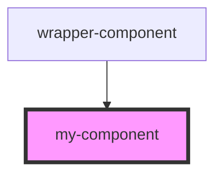

# my-component

<!-- Auto Generated Below -->

## Properties

| Property | Attribute | Description     | Type     | Default |
| -------- | --------- | --------------- | -------- | ------- |
| `first`  | `first`   | The first name  | `string` | `''`    |
| `last`   | `last`    | The last name   | `string` | `''`    |
| `middle` | `middle`  | The middle name | `string` | `''`    |

## Methods

### `transfomFirstName() => Promise<void>`

#### Returns

Type: `Promise<void>`

## Dependencies

### Used by

 - [wrapper-component](../wrapper-component)

### Graph

----------------------------------------------

*Built with [StencilJS](https://stenciljs.com/)*
