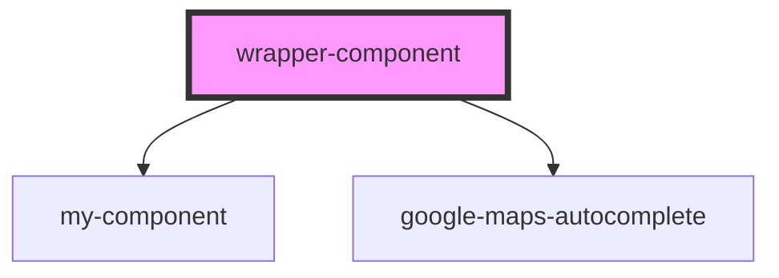

# wrapper-component

<!-- Auto Generated Below -->

## Dependencies

### Depends on

- [my-component](../my-component)
- [google-maps-autocomplete](../google-maps-autocomplete)

### Graph

----------------------------------------------

*Built with [StencilJS](https://stenciljs.com/)*
